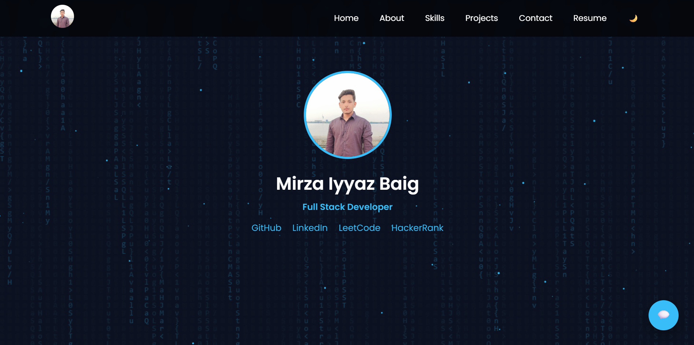

# 🚀 Mirza Iyyaz Baig - Full Stack Developer Portfolio

## 📋 Description

Welcome to my professional portfolio website! This is a modern, responsive, and interactive portfolio built with **HTML5, CSS3, and JavaScript**. It showcases my skills as a Full Stack Developer, featuring a sleek dark-themed design with animated elements and particle effects.

### ✨ Key Features

- **Responsive Design**: Fully mobile-optimized with smooth navigation
- **Dark Mode & Light Mode**: Toggle between dark and light themes
- **Animated Elements**: Smooth scroll animations powered by AOS (Animate On Scroll)
- **Typing Animation**: Dynamic role switching with typewriter effect
- **Particle Effects**: Beautiful animated particle background
- **Matrix Rain Effect**: Stylish matrix-inspired code rain animation
- **GitHub Integration**: Automatically fetches and displays your 6 latest GitHub projects
- **Social Bubble**: Quick access floating menu for social media links
- **Smooth Scrolling**: Enhanced UX with smooth scroll behavior
- **Contact Form**: Integrated contact form using Formspree
- **Modern UI**: Tailored design with gradient effects and smooth transitions

## 🎯 Sections

1. **Home** - Hero section with profile image, typing animation, and download resume button
2. **About** - Personal introduction and professional background
3. **Skills** - Technical expertise with animated progress bars
4. **Projects** - Showcase of GitHub projects with auto-fetch functionality
5. **Contact** - Contact form for inquiries

## 🛠️ Tech Stack

- **Frontend**: HTML5, CSS3, JavaScript (Vanilla)
- **Styling**: Custom CSS with responsive design
- **Animations**: AOS (Animate On Scroll), Canvas animations
- **APIs**: GitHub API for auto-fetching projects
- **Form Handling**: Formspree

## 📦 Project Structure

```
Portfolio/
├── index.html                          # Main HTML file
├── profile.jpg                         # Profile image
├── Mirza_Iyyaz_Baig_Resume.pdf        # Resume PDF
├── images/
│   └── Screenshot.png                  # Portfolio screenshot
└── README.md                           # This file
```

## 🎨 Screenshots



## 🚀 Features in Detail

### Typing Animation
The hero section features a typing animation that cycles through different roles:
- Full Stack Developer
- Java & Angular Developer
- Frontend & Backend Engineer

### Progress Bars
Animated skill bars that fill up when scrolled into view, displaying proficiency levels in:
- Java (90%)
- Python (70%)
- JavaScript (90%)
- HTML5 (95%)
- CSS3 (95%)
- Bootstrap (90%)
- Angular (85%)
- MySQL (90%)

### GitHub Projects Integration
Automatically fetches your 6 latest repositories from GitHub with descriptions and links.

### Social Bubble
Floating social menu with quick links to:
- GitHub
- LinkedIn
- Instagram
- Facebook
- WhatsApp
- Email

### Theme Toggle
Easy dark/light mode switching for better accessibility and user preference.

## 💻 Local Development

1. Clone the repository:
```bash
git clone https://github.com/iyyazbaig/Portfolio.git
```

2. Navigate to the project directory:
```bash
cd Portfolio
```

3. Open `index.html` in your browser or use a local server:
```bash
# Using Python
python -m http.server 8000

# Using Node.js
npx http-server
```

4. Visit `http://localhost:8000` in your browser

## 🌐 Live Demo

The portfolio is hosted and can be viewed at your GitHub Pages URL (if configured).

## 📝 Customization

### Update Personal Information
Edit the following in `index.html`:
- Name and title
- About section text
- Social media links (GitHub, LinkedIn, LeetCode, HackerRank)
- Email address
- Resume PDF link
- Contact form endpoint (Formspree)

### Customize Colors
Modify the primary color (`#38bdf8`) in the CSS section to your preferred color scheme.

### Update Profile Image
Replace `profile.jpg` with your own image and update references in the HTML.

## 📞 Contact & Social Links

- **GitHub**: [github.com/iyyazbaig](https://github.com/iyyazbaig)
- **LinkedIn**: [linkedin.com/in/mirza-iyyaz-baig](https://linkedin.com/in/mirza-iyyaz-baig)
- **LeetCode**: [leetcode.com/u/iyyaz_baig](https://leetcode.com/u/iyyaz_baig)
- **HackerRank**: [hackerrank.com/iyyaz3313](https://hackerrank.com/iyyaz3313)
- **Instagram**: [instagram.com/iyyaz_baig](https://instagram.com/iyyaz_baig)
- **Facebook**: [facebook.com/iyyaz.baig](https://www.facebook.com/iyyaz.baig/)
- **WhatsApp**: [+91 9397893313](https://wa.me/919397893313)
- **Email**: [iyyaz3313@gmail.com](mailto:iyyaz3313@gmail.com)

## 📄 Resume

Download my resume: [Mirza_Iyyaz_Baig_Resume.pdf](Mirza_Iyyaz_Baig_Resume.pdf)

## 🎓 About Me

I'm a passionate Full Stack Developer with a Bachelor of Computer Applications (BCA) degree. I specialize in building modern, responsive web applications that solve real-world problems. My expertise includes:

- **Backend**: Java, Python, MySQL
- **Frontend**: JavaScript, HTML5, CSS3, Angular, Bootstrap
- **Project Development**: Full-stack applications including AI-Enabled E-Governance Portal, Event Booking Platform, and Student Management System

I'm continuously learning new technologies and improving my coding skills to build clean, scalable applications.

## 📄 License

This project is open source and available under the MIT License.

## 🙏 Acknowledgments

- **AOS Library** - [Animate On Scroll](https://michalsnik.github.io/aos/)
- **Google Fonts** - Poppins font family
- **Formspree** - Contact form backend
- **GitHub API** - Project auto-fetch functionality

---

**Last Updated**: 2026-03-15 19:38:09

**Portfolio Version**: 1.0.0